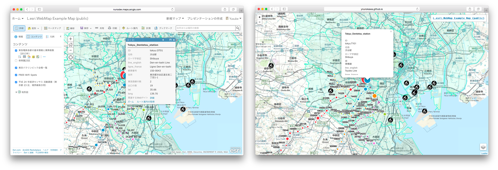

# L.esri.WebMap

[](https://travis-ci.org/ynunokawa/L.esri.WebMap)

A plugin to display [ArcGIS Web Map](http://doc.arcgis.com/en/arcgis-online/reference/what-is-web-map.htm) on Leaflet maps.



You can see it with just 1 line code.

```JavaScript
// L.esri.WebMap(webmapId, { map: L.Map });
var webmap = L.esri.webMap('22c504d229f14c789c5b49ebff38b941', { map: L.map('map') });
```

Web Map has an enormous spec. So, welcome your contributions to support fully!

## Demo

You can see your web maps (that are open to the public) with URL parameter as the below.

`http://ynunokawa.github.io/L.esri.WebMap/index.html?webmap=[your webmap id]`

* [Various styles for a feature layer](http://ynunokawa.github.io/L.esri.WebMap/index.html?webmap=722f3d8ed5e94babbe78c8236a28b42e)
* [2 ArcGIS WebMaps in 1 leaflet map](http://ynunokawa.github.io/L.esri.WebMap/examples/two-in-one.html)
* []()

## Development Instructions

1. [Fork and clone](https://help.github.com/articles/fork-a-repo/) L.esri.WebMap
2. `cd` into the `L.esri.WebMap` folder
3. Install the dependencies with `npm install`
4. Run `npm start` from the command line. This will compile minified source in a brand new dist directory, launch a tiny webserver and begin watching the raw source for changes
5. Run `npm lint` to improve the code that you have added or updated
6. Make your changes and create a [pull request](https://help.github.com/articles/creating-a-pull-request/)

## Limitations

Please see [here](https://github.com/ynunokawa/L.esri.WebMap/wiki/Supported-Features).

## License
Copyright 2016 Yusuke Nunokawa.

MIT.
